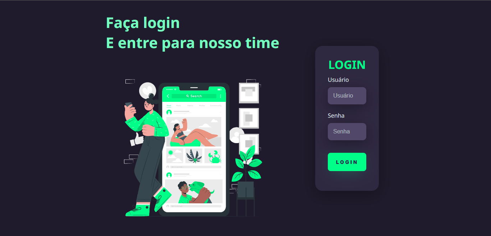

# TELA DE LOGIN

• Projeto criado com base de aprimoramento de conhecimento, aonde utilizei conhecimentos basiados em estudos.

 

## Tecnologias utilizadas

 

 
 
 

## Redes sociais

<h4 align="center">
    Feito com 🖤 by <a href="https://www.linkedin.com/in/lcamargodasilva/" target="_blank">Lucas Camargo</a>
</h4>
